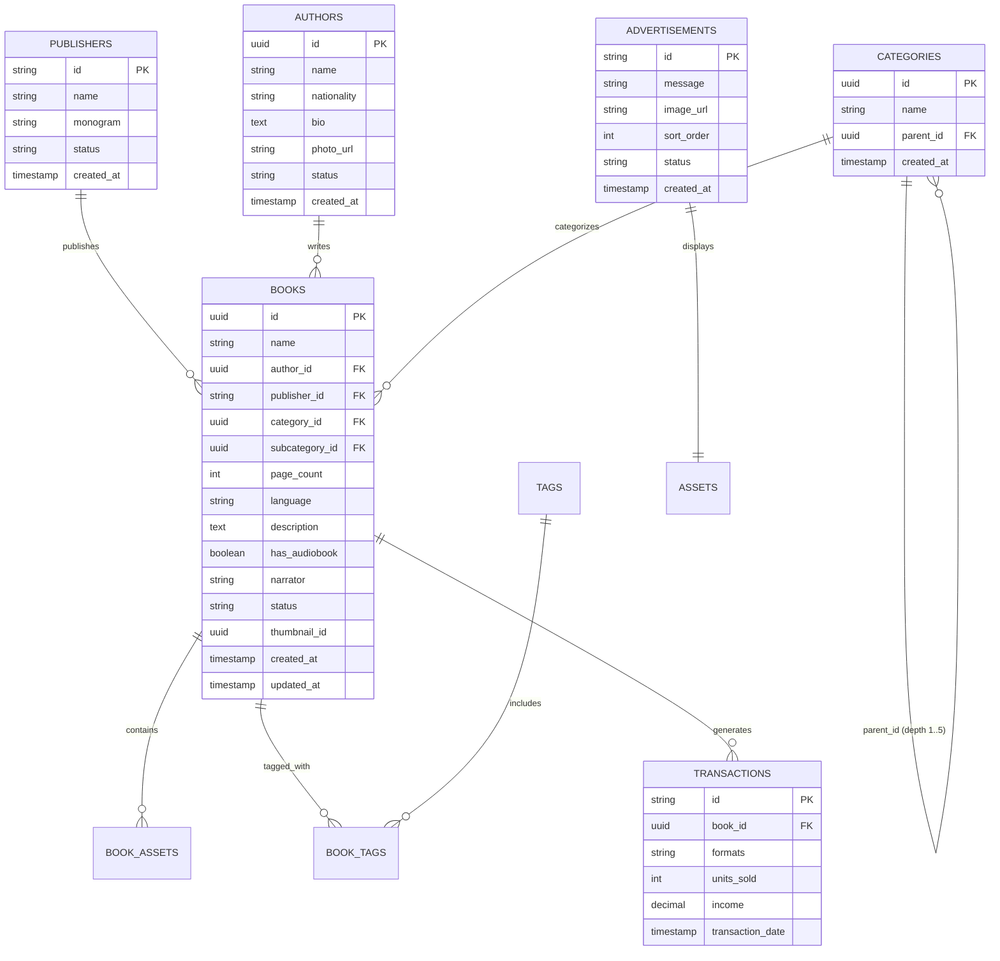

# TEWBA Book Store Admin - Backend Implementation Handoff

> **Target Audience**: Backend Engineers & Backend AI Coding Agents  
> **Source of Truth**: Current Frontend Source Code, Approved Figma Design (`BOOK-STORE-FIGMA.pptx`), PM Product Requirements, and Base Contract (`references/openapi.yaml`).  
> **Companion Files**:
> - Machine-readable OpenAPI 3.1 Delta: [`docs/backend-api-delta.yaml`](file:///c:/Users/azwis/OneDrive/Desktop/Doc/Pro/Internship/Book%20Store%20Admin-side/Book-store%20admin%20Frontend/docs/backend-api-delta.yaml)
> - Field-by-Field Completeness Audit: [`docs/frontend-backend-field-matrix.md`](file:///c:/Users/azwis/OneDrive/Desktop/Doc/Pro/Internship/Book%20Store%20Admin-side/Book-store%20admin%20Frontend/docs/frontend-backend-field-matrix.md)

---

## 1. Purpose

The TEWBA Book Store Admin frontend is fully built and feature-complete. It incorporates the updated Figma designs, multi-format digital catalog requirements (EPUB + Audiobooks), a 5-level nested taxonomy tree, mobile promotional banner management with drag-and-drop reordering, and an executive circulation and transactions reporting dashboard.

This document serves as the implementation specification for the backend team. It defines:
1. What already exists in the backend that the frontend directly consumes.
2. What existing endpoints must be extended with additional request/response fields.
3. What new endpoints must be implemented.
4. Exact schemas, validation constraints, relationship models, and JSON payloads.

---

## 2. Existing Backend Capabilities (Already Supported)

The existing backend contract in `references/openapi.yaml` already supports the following admin-relevant operations:

| Method | Existing Endpoint | Operation ID | Frontend Status |
|---|---|---|---|
| `POST` | `/api/auth/phone/signin` | `signin-phone` | **Consumes directly** via `AuthService` |
| `GET` | `/admin/api/author` | `list-authors` | **Consumes directly** (requires extension for nationality/bio/photo) |
| `POST` | `/admin/api/author` | `create-author` | **Consumes directly** (requires extension for nationality/bio/photo) |
| `GET` | `/admin/api/book` | `list-book` | **Consumes directly** (requires extension for publisher/audio/filters) |
| `POST` | `/admin/api/book` | `create-book` | **Consumes directly** (requires extension for extended catalog fields) |
| `GET` | `/api/book/{book_id}` | `get-book` | **Consumes directly** (requires extension for detail fields) |
| `POST` | `/admin/api/book/{book_id}/asset` | `add-book-asset` | **Consumes directly** (binds `'book'` and `'audio'` files) |
| `POST` | `/admin/api/book/{book_id}/tag` | `add-book-tag` | **Consumes directly** (binds `tag_id` to `book_id`) |
| `POST` | `/admin/api/category` | `create-category` | **Consumes directly** (accepts `name` and `parent_id`) |
| `POST` | `/api/category` | `list-categories` | **Consumes directly** (reads category list with optional `parent_id`) |
| `POST` | `/admin/api/upload/init` | `init-book-upload` | **Consumes directly** (initiates multipart session) |
| `POST` | `/admin/api/upload/get-part` | `get-book-upload-part-url` | **Consumes directly** (retrieves presigned chunk PUT URLs) |
| `POST` | `/admin/api/upload/complete` | `complete-book-upload` | **Consumes directly** (needs `{ file_id: "uuid" }` response) |

---

## 3. Required Backend Additions (New Endpoints)

The following resources and operations are completely missing from `references/openapi.yaml` and must be created:

### 3.1. Publishers Management (`/publishers`)
* `GET /admin/api/publisher`: Paginated list of publishers with search (`search`, `page`, `page_size`).
* `POST /admin/api/publisher`: Register new publisher (`name`, optional `monogram`).
* `GET /admin/api/publisher/{id}`: Retrieve publisher record.
* `PUT /admin/api/publisher/{id}`: Update publisher record.
* `DELETE /admin/api/publisher/{id}`: Remove publisher.

### 3.2. Advertisements / Carousel Management (`/advertisements`)
* `GET /admin/api/advertisement`: List all promotional banners ordered by `order` ASC.
* `POST /admin/api/advertisement`: Create a banner (`message`, `image_url`, `order`, `status`).
* `PUT /admin/api/advertisement/reorder`: **Atomic batch reorder** taking an array of IDs: `{ "ordered_ids": ["ad-02", "ad-01", ...] }`.
* `PUT /admin/api/advertisement/{id}`: Update banner copy, image, or order.
* `PATCH /admin/api/advertisement/{id}/status`: Toggle active/disabled status.
* `DELETE /admin/api/advertisement/{id}`: Delete a promotional banner.

### 3.3. Reports & Circulation Analytics (`/reports`)
* `GET /admin/api/reports`: Aggregated reporting overview taking query params `period` (`today`, `7d`, `30d`, `custom`) and optional `start_date`, `end_date`.
  - Returns `summary` (`books_sold`, `total_income`, `audiobook_books`, growth percentages).
  - Returns `daily_trend` array (`date`, `books_sold`, `audiobooks_sold`, `revenue`).
  - Returns `top_books` array (Rank 1-5, title, subtitle, sold count, share %).
  - Returns `top_audiobooks` array (Rank 1-5, title, subtitle, sold count, hours played).
* `GET /admin/api/reports/transactions`: Paginated transaction records (`page`, `page_size`, `search`, `period`, `start_date`, `end_date`).
  - Returns `id`, `book_id`, `title`, `category`, `author`, `publisher`, `formats`, `units_sold`, `income`, `date`.

### 3.4. Tag Catalog Discovery & Detachment
* `GET /admin/api/tag`: List registered tags for dropdown selection in the book form.
* `POST /admin/api/tag`: Create new tag with optional hex color (`name`, `color`).
* `DELETE /admin/api/book/{book_id}/tag/{tag_id}`: Detach a tag from a book.

### 3.5. Missing CRUD Operations on Existing Resources
* `PUT /admin/api/category/{id}`: Rename category or subcategory.
* `DELETE /admin/api/category/{id}`: Delete category and cascade delete descendant subcategories.
* `PUT /admin/api/author/{id}`: Update author metadata, bio, nationality, or photo.
* `DELETE /admin/api/author/{id}`: Delete author from directory.
* `GET /admin/api/author/{id}`: Author profile and linked catalog books.
* `PUT /admin/api/book/{id}`: Update catalog book metadata, language, status, and classification.
* `DELETE /admin/api/book/{id}`: Delete or archive book title.

---

## 4. Required Extensions to Existing Endpoints

### 4.1. `GET /admin/api/author` (`list-authors`)
* **Standardize Property Name**: In `ListAuthorItem`, rename `"string"` to `"name"`:
  ```json
  // Existing:
  { "id": "uuid", "string": "Naguib Mahfouz" }
  // Desired:
  { "id": "uuid", "name": "Naguib Mahfouz" }
  ```
* **Add Response Properties**:
  - `nationality`: `string` (max 64, e.g. `"Yemeni"`, `"Egyptian"`).
  - `bio`: `string` (max 1024, author biography).
  - `photo_url`: `string` (URI to profile headshot).
  - `works_count`: `integer` (count of published titles, e.g. `4`).
  - `status`: `string` (`"active"` or `"inactive"`).
* **Add Query Parameter**: `search` (case-insensitive string search over author name).

### 4.2. `POST /admin/api/author` (`create-author`)
* **Extend Request Body**: Add optional fields:
  ```json
  {
    "name": "Ghassan Kanafani",
    "nationality": "Palestinian",
    "bio": "Novelist, short-story writer, and journalist...",
    "photo_url": "https://storage.tewba.com/authors/kanafani.jpg"
  }
  ```
  *(Note: PM confirmed that "Primary Genre" and "Joined Date" have been removed and replaced by "Nationality".)*

### 4.3. `GET /admin/api/book` (`list-book`)
* **Add Query Parameters**:
  - `search`: Filter by book name, author name, or publisher name.
  - `category`: Filter by category name or ID.
  - `status`: Filter by status (`Published`, `Draft`, `Review`, `Archived`).
  - `has_audiobook`: Filter by boolean (`true` or `false`).
* **Add Response Properties to `ListBookItem`**:
  - `publisher`: `string` (publisher imprint name).
  - `publisher_id`: `string` (publisher ID).
  - `category`: `string` (primary category name).
  - `category_id`: `string` (primary category ID).
  - `has_audiobook`: `boolean` (flag indicating audiobook support).
  - `cover_url`: `string` (direct URL to thumbnail image).
  - `thumbnail_id`: `string` (UUID).

### 4.4. `POST /admin/api/book` (`create-book`)
* **Extend Request Body**: Base OpenAPI only accepts `{ name, description, author_id, thumbnail_id }`. It must accept:
  ```json
  {
    "name": "The Midnight Library",
    "author_id": "c79435b6-6f78-4ea7-9a40-02daff90e501",
    "publisher_id": "PUB-001",
    "category_id": "b3f2e100-0000-4000-8000-000000000001",
    "subcategory_id": "b3f2e100-0000-4000-8000-000000000002",
    "description": "Between life and death there is a library...",
    "page_count": 304,
    "language": "English",
    "thumbnail_id": "d1234567-e89b-12d3-a456-426614174000",
    "has_audiobook": true,
    "narrator": "Carey Mulligan",
    "tags": ["Literary Fiction", "Bestseller"]
  }
  ```

### 4.5. `POST /admin/api/upload/complete` (`complete-book-upload`)
* **Contract Fix**: In the base OpenAPI, `POST /admin/api/upload/complete` returns HTTP 200 with an empty body.
* **Required Addition**: The backend MUST return `{ "file_id": "uuid", "key": "string" }` upon completion:
  ```json
  {
    "file_id": "d1234567-e89b-12d3-a456-426614174000",
    "key": "uploads/sess_123/asset",
    "size_bytes": 54525952
  }
  ```
  This is required because the subsequent `/admin/api/book/{book_id}/asset` endpoint requires `file_id: format: uuid`.

---

## 5. Entity & Data Model Relationships



---

## 6. Detailed Request & Response Examples

### 6.1. Publisher Endpoints

#### `POST /admin/api/publisher`
**Request**:
```json
{
  "name": "Darussalam Publishers",
  "monogram": "DP"
}
```
**Response (201 Created)**:
```json
{
  "id": "PUB-001",
  "name": "Darussalam Publishers",
  "monogram": "DP",
  "books_count": 0,
  "status": "Active",
  "created_at": "2026-10-06T10:00:00Z",
  "updated_at": "2026-10-06T10:00:00Z"
}
```

#### `GET /admin/api/publisher?page=1&page_size=10&search=dar`
**Response (200 OK)**:
```json
{
  "publishers": [
    {
      "id": "PUB-001",
      "name": "Darussalam Publishers",
      "monogram": "DP",
      "books_count": 142,
      "status": "Active",
      "created_at": "2026-09-01T08:00:00Z",
      "updated_at": "2026-10-01T12:00:00Z"
    }
  ],
  "total": 1,
  "page": 1,
  "page_size": 10
}
```

---

### 6.2. Advertisement Endpoints

#### `POST /admin/api/advertisement`
**Request**:
```json
{
  "message": "Ramadan & Eid Book Fair — 30% OFF Classical Works",
  "image_url": "https://storage.tewba.com/banners/ramadan-fair.png",
  "order": 1,
  "status": "active"
}
```
**Response (201 Created)**:
```json
{
  "id": "ad-01",
  "message": "Ramadan & Eid Book Fair — 30% OFF Classical Works",
  "image_url": "https://storage.tewba.com/banners/ramadan-fair.png",
  "order": 1,
  "status": "active",
  "created_at": "2026-10-06T10:00:00Z"
}
```

#### `PUT /admin/api/advertisement/reorder`
**Request**:
```json
{
  "ordered_ids": ["ad-03", "ad-01", "ad-02", "ad-04"]
}
```
**Response (200 OK)**:
```json
[
  { "id": "ad-03", "message": "Audiobook Week", "order": 1, "status": "active", "image_url": "..." },
  { "id": "ad-01", "message": "Ramadan Fair", "order": 2, "status": "active", "image_url": "..." },
  { "id": "ad-02", "message": "Scholar Spotlight", "order": 3, "status": "active", "image_url": "..." },
  { "id": "ad-04", "message": "Autumn Curation", "order": 4, "status": "disabled", "image_url": "..." }
]
```

---

### 6.3. Reports & Analytics Endpoints

#### `GET /admin/api/reports?period=30d`
**Response (200 OK)**:
```json
{
  "summary": {
    "books_sold": 1420,
    "books_sold_growth_percent": 14.8,
    "total_income": 544989.00,
    "total_income_growth_percent": 150.0,
    "audiobook_books": 642,
    "audiobook_share_percent": 45.2,
    "sales_period_label": "May 01, 2024 – May 31, 2024"
  },
  "daily_trend": [
    { "date": "May 01", "books_sold": 180, "audiobooks_sold": 90, "revenue": 14200.00 },
    { "date": "May 07", "books_sold": 280, "audiobooks_sold": 140, "revenue": 21500.00 },
    { "date": "May 14", "books_sold": 420, "audiobooks_sold": 210, "revenue": 34800.00 },
    { "date": "May 21", "books_sold": 560, "audiobooks_sold": 320, "revenue": 49200.00 },
    { "date": "May 28", "books_sold": 640, "audiobooks_sold": 380, "revenue": 58900.00 },
    { "date": "May 31", "books_sold": 710, "audiobooks_sold": 410, "revenue": 64500.00 }
  ],
  "top_books": [
    { "rank": 1, "book_id": "b1010000-0000-4000-8000-000000000001", "title": "The Sealed Nectar", "subtitle": "Ar-Raheeq Al-Makhtum", "sold_count": 420, "percent_of_sales": 30.0 },
    { "rank": 2, "book_id": "b1010000-0000-4000-8000-000000000002", "title": "Revival of the Religious", "subtitle": "Ihya Ulum al-Din", "sold_count": 315, "percent_of_sales": 22.0 },
    { "rank": 3, "book_id": "b1010000-0000-4000-8000-000000000003", "title": "Lost Islamic History", "subtitle": "Reclaiming Muslim Civilisation", "sold_count": 260, "percent_of_sales": 18.0 },
    { "rank": 4, "book_id": "b1010000-0000-4000-8000-000000000004", "title": "Destiny Disrupted", "subtitle": "A History of the World", "sold_count": 198, "percent_of_sales": 14.0 },
    { "rank": 5, "book_id": "b1010000-0000-4000-8000-000000000005", "title": "The Book of Wisdom", "subtitle": "Kitab al-Hikma", "sold_count": 142, "percent_of_sales": 10.0 }
  ],
  "top_audiobooks": [
    { "rank": 1, "book_id": "b1010000-0000-4000-8000-000000000001", "title": "The Sealed Nectar", "subtitle": "Ar-Raheeq Al-Makhtum", "sold_count": 420, "hours_played": 500.0 },
    { "rank": 2, "book_id": "b1010000-0000-4000-8000-000000000002", "title": "Revival of the Religious", "subtitle": "Ihya Ulum al-Din", "sold_count": 315, "hours_played": 280.0 },
    { "rank": 3, "book_id": "b1010000-0000-4000-8000-000000000003", "title": "Lost Islamic History", "subtitle": "Reclaiming Muslim Civilisation", "sold_count": 260, "hours_played": 200.0 },
    { "rank": 4, "book_id": "b1010000-0000-4000-8000-000000000004", "title": "Destiny Disrupted", "subtitle": "A History of the World", "sold_count": 198, "hours_played": 150.0 },
    { "rank": 5, "book_id": "b1010000-0000-4000-8000-000000000005", "title": "The Book of Wisdom", "subtitle": "Kitab al-Hikma", "sold_count": 142, "hours_played": 40.0 }
  ]
}
```

#### `GET /admin/api/reports/transactions?page=1&page_size=5`
**Response (200 OK)**:
```json
{
  "transactions": [
    {
      "id": "TXN-01",
      "book_id": "b1010000-0000-4000-8000-000000000001",
      "title": "Sahih Bukhari",
      "category": "Hadith",
      "author": "Imam Al-Bukhari",
      "publisher": "Darussalam Publishing house",
      "formats": ["Print", "EPUB", "Audio"],
      "units_sold": 5420,
      "income": 32520.00,
      "date": "2026-05-31T18:00:00Z"
    },
    {
      "id": "TXN-02",
      "book_id": "b1010000-0000-4000-8000-000000000002",
      "title": "Riyad Asalihin",
      "category": "Hadith",
      "author": "Imam Al-Nawawi",
      "publisher": "Darussalam Publishing house",
      "formats": ["Print", "EPUB", "Audio"],
      "units_sold": 4110,
      "income": 26715.00,
      "date": "2026-05-31T17:30:00Z"
    }
  ],
  "total": 342,
  "page": 1,
  "page_size": 5
}
```

---

## 7. Master Language Specification (PM Requirement)

> **Critical Rule**: Master Language applies to **BOTH** the written book text and the audiobook narration. It is **NOT** an audio-only field.

* **Backend Model**: Store `language` directly on the `books` table (e.g. `VARCHAR(64) DEFAULT 'English'`).
* **Validation**:
  - Required during book creation.
  - Supported initial options in UI: `English`, `Amharic`, `Arabic`, `French`, `Oromo`, `Somali`.
* If a title has an audiobook master, the audio is understood to be recorded in this master language unless an explicit translation asset is linked in future phases.

---

## 8. Audiobook & AI Generation Specification

* **Has Audiobook Toggle**: Persisted as `has_audiobook` (`BOOLEAN DEFAULT FALSE`).
* **Audio Track File**: Stored as an asset linked via `POST /admin/api/book/{book_id}/asset` with `asset_type: "audio"`.
* **Narrator Name**: Stored on `books.narrator` (`VARCHAR(128) NULLABLE`).
* **AI Audiobook Generation**:
  - The UI provides a radio option: `[Has Recorded Audio]` vs `[Generated Using AI (Future)]`.
  - **Explicit Instruction**: Actual automated AI voice synthesis is a future roadmap capability.
  - The backend is **NOT** expected to implement any AI conversion microservice or background worker pipeline for this release.
  - If desired, the backend may store an enum or flag `audio_production_mode: 'manual' | 'ai_pending' | 'none'`, but no audio generation processing is required.

---

## 9. Multipart Upload & Asset Binding Flow

The browser uploads files directly to cloud storage (S3 / GCS) via presigned URLs in 5MB chunks:

```
[Browser Dropzone] -- 1. POST /admin/api/upload/init ---------> [Backend API]
                  <-- returns { key, upload_id, session_id } -

[Browser Dropzone] -- 2. POST /admin/api/upload/get-part ------> [Backend API]
                  <-- returns { url: presigned_put_url } -----
                  -- 3. Direct PUT chunk to Storage ----------> [S3 / GCS]
                  <-- returns HTTP 200 + ETag ----------------

[Browser Dropzone] -- 4. POST /admin/api/upload/complete ------> [Backend API]
                  <-- returns { file_id: "uuid", key } -------

[Browser Form]     -- 5. POST /admin/api/book/{id}/asset ------> [Backend API]
                         body: { asset_type, file_id }
```

### Allowed File Types & Size Limits
* **Cover / Thumbnail**: PNG, JPEG, WEBP (Max 10MB) -> `thumbnail_id` on Book.
* **Book Master**: EPUB, PDF (Max 100MB) -> `asset_type: "book"`.
* **Audio Master**: MP3, M4B, M4A (Max 500MB) -> `asset_type: "audio"`.
* **Author Headshot**: PNG, JPEG, WEBP (Max 5MB) -> `photo_url` on Author.
* **Ad Banner Image**: PNG, JPEG, WEBP (Max 10MB) -> `image_url` on Advertisement.

---

## 10. Taxonomy & Hierarchy (Categories & Subcategories)

The catalog supports up to **5 levels of nested taxonomy** (`L1` Root to `L5` Leaf):

* **Database Model**: Self-referencing table `categories` with `parent_id`:
  - `id`: `UUID PK`
  - `name`: `VARCHAR(128) NOT NULL`
  - `parent_id`: `UUID NULLABLE FK -> categories(id) ON DELETE CASCADE`
* **Hierarchy Invariant**:
  - If `parent_id IS NULL`, depth is Level 1 (Root).
  - New subcategories cannot be added beneath a Level 5 category (maximum depth reached).
* **Endpoints**:
  - `POST /admin/api/category`: Accepts `{ "name": "...", "parent_id": "uuid" | null }`.
  - `PUT /admin/api/category/{id}`: Renames category.
  - `DELETE /admin/api/category/{id}`: Deletes category and cascades deletion to child subcategories.

---

## 11. Pagination, Search & Filter Conventions

All paginated endpoints must adhere to the existing backend convention:

### Query Parameters
* `page`: `integer` (Default: `1`, minimum: `1`).
* `page_size`: `integer` (Default: `10`, allowed: `10, 20, 50, 100`).
* `search`: `string` (Optional, case-insensitive substring search).

### Response Structure
```json
{
  "items": [...],
  "total": 142,
  "page": 1,
  "page_size": 10
}
```

---

## 12. Error Handling & Validation Format

The backend must return errors complying with **RFC 7807 (`application/problem+json`)** matching the existing `ErrorModel`:

```json
{
  "type": "https://errors.tewba.com/validation-error",
  "title": "Unprocessable Entity",
  "status": 422,
  "detail": "One or more validation constraints failed.",
  "errors": [
    {
      "location": "body.name",
      "message": "Book title cannot exceed 128 characters.",
      "value": "..."
    },
    {
      "location": "body.author_id",
      "message": "Referenced author does not exist."
    }
  ]
}
```

### Standard Status Codes
* `200 OK`: Successful read or update.
* `201 Created`: Resource successfully registered.
* `204 No Content`: Successful deletion.
* `400 Bad Request`: Malformed JSON syntax.
* `401 Unauthorized`: Missing or expired Bearer JWT.
* `403 Forbidden`: Admin role required.
* `404 Not Found`: Target resource does not exist.
* `422 Unprocessable Entity`: Field validation failures.
* `500 Internal Server Error`: Server exception.

---

## 13. Known Ambiguities & Decisions Needing Confirmation

| # | Topic | Current Frontend Assumption | Question for Backend / PM | Recommendation |
|---|---|---|---|---|
| 1 | **Revenue / Income Semantics** | Reports display total income (e.g. `$544,989.00`). | Is this gross GMV or net settlement after publisher royalties and payment processor fees? | **Recommendation**: Expose both `gross_revenue` and `net_income` in the report summary, defaulting to gross for the top-level card. |
| 2 | **Author Nationality** | Stored as text (e.g. `"Yemeni"`, `"Egyptian"`). | Should this be free text or a validated ISO 3166-1 alpha-2 / country enum? | **Recommendation**: Accept string up to 64 chars; validate on frontend. |
| 3 | **Tag Creation during Book Form** | Admin can type custom tag and pick a color. | Should new tags be auto-created in a global `tags` table, or pre-registered? | **Recommendation**: Backend should auto-create the tag record if not found by name. |
| 4 | **Admin RBAC Permissions** | Shell displays user profile with role `"Content Manager"`. | Are permissions role-based (RBAC) or is any authenticated staff user a full admin? | **Recommendation**: Treat all `/admin/api/*` endpoints as requiring standard admin role for now. |

---

## 14. Backend Implementation Checklist

Use this checklist to track backend task completion:

- [ ] **1. Upload Handoff Contract Fix**:
  - Update `POST /admin/api/upload/complete` to return `{ "file_id": "uuid", "key": "string" }`.
- [ ] **2. Author API Extensions**:
  - Rename `string` -> `name` in `ListAuthorItem` (or provide both for backward compatibility).
  - Add `nationality`, `bio`, `photo_url`, `works_count`, `status` to `ListAuthorItem`.
  - Add `nationality`, `bio`, `photo_url` to `CreateAuthorRequestBody`.
  - Implement `GET /admin/api/author/{id}`, `PUT /admin/api/author/{id}`, and `DELETE /admin/api/author/{id}`.
- [ ] **3. Book API Extensions**:
  - Extend `POST /admin/api/book` to accept `publisher_id`, `category_id`, `subcategory_id`, `page_count`, `language`, `has_audiobook`, `narrator`, and `tags`.
  - Extend `GET /admin/api/book` to return `publisher`, `publisher_id`, `category`, `category_id`, `has_audiobook`, and `cover_url`.
  - Implement `PUT /admin/api/book/{id}` and `DELETE /admin/api/book/{id}`.
- [ ] **4. Publisher APIs (New)**:
  - Create `publishers` database table with `id`, `name`, `monogram`, `status`, `created_at`.
  - Implement `GET /admin/api/publisher`, `POST /admin/api/publisher`, `GET /admin/api/publisher/{id}`, `PUT /admin/api/publisher/{id}`, `DELETE /admin/api/publisher/{id}`.
- [ ] **5. Category APIs**:
  - Ensure self-referencing hierarchy supports up to 5 levels via `parent_id`.
  - Implement `PUT /admin/api/category/{id}` and `DELETE /admin/api/category/{id}`.
- [ ] **6. Advertisement APIs (New)**:
  - Create `advertisements` table with `id`, `message`, `image_url`, `order`, `status`.
  - Implement `GET /admin/api/advertisement`, `POST /admin/api/advertisement`, `PUT /admin/api/advertisement/{id}`, `DELETE /admin/api/advertisement/{id}`.
  - Implement `PUT /admin/api/advertisement/reorder` (atomic batch update).
  - Implement `PATCH /admin/api/advertisement/{id}/status`.
- [ ] **7. Reports & Analytics APIs (New)**:
  - Implement `GET /admin/api/reports` with `period` parameter and aggregated summary, daily trend, top books, top audiobooks.
  - Implement `GET /admin/api/reports/transactions` with pagination and search.
- [ ] **8. Tag Management APIs**:
  - Implement `GET /admin/api/tag` and `POST /admin/api/tag`.
  - Implement `DELETE /admin/api/book/{book_id}/tag/{tag_id}`.
